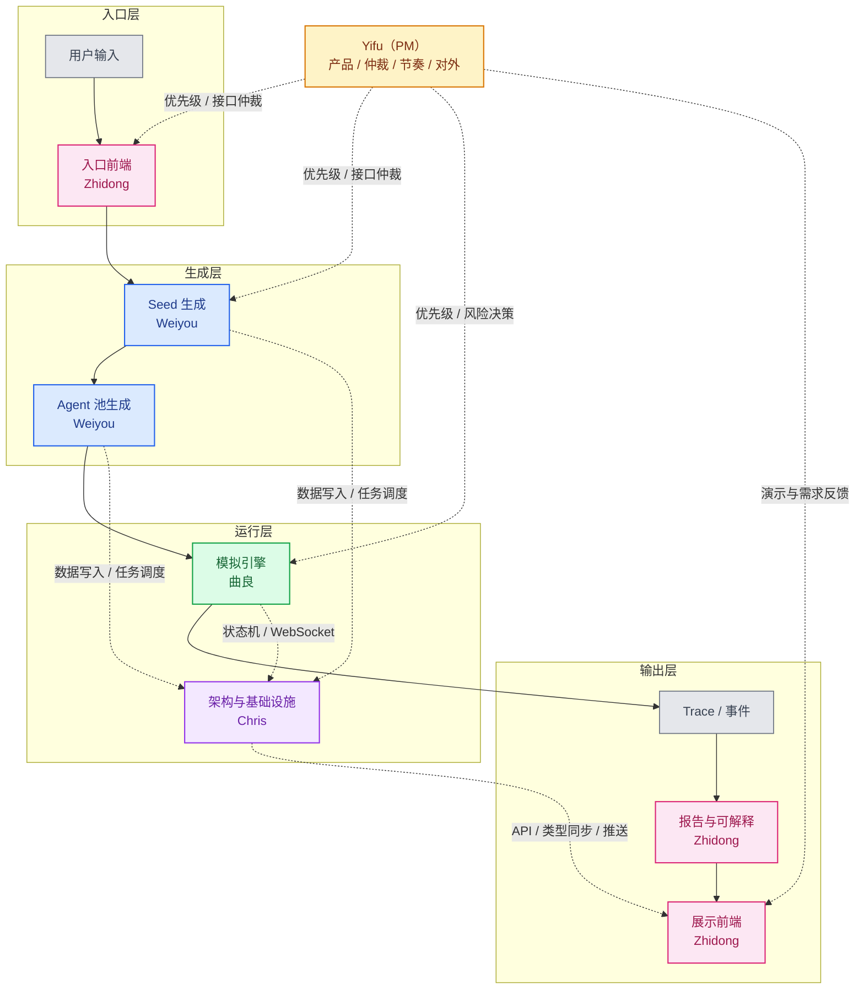

# BizSim 团队分工与协作方案

> 编制日期：2026-04-11
> 适用范围：business-validation-demo（BizSim POC/MVP）
> 团队规模：5 人（1 PM + 4 研发）
> 前置文档：[开发路线图](./开发路线图.md) · [技术方案与实施指南](./技术方案与实施指南.md) · [开发方案](./开发方案.md)

---

## 0. 本文目的

本文给出 BizSim 项目（商业验证 Demo）从当前阶段（Phase 1 末尾，005 seed-builder 接近完成）到 Phase 3 结束（端到端可演示）所需的团队分工方案。目标是：

1. 让 **OASIS 模拟引擎适配**、**Agent 建模与生成**、**工程架构与基础设施**、**可解释性与可视化** 四条研发主线并行推进，互不卡脖子。
2. 给出每个人的 **主要工作领域 / 输入输出 / 对接契约（高层）/ 对应的现有 Spec 编号**，方便每个人能自己找到"我应该从哪里开始"。
3. 不是一份细致的 interface design——只是一张 **工作地图**，等对接细节明确后再写到各 Spec 的 design doc 里。

---

## 1. 结论速览：五个角色

我们把 BizSim 拆成一条"输入 → Agent 生成 → 模拟运行 → 报告"的管线，每段管线有一个 owner，加一个工程架构与基础设施负责人，再由 PM 统筹协调。

| 姓名 | 角色代号 | 一句话定位 | 对应文档线索 | 当前阶段主要 Spec |
|---|---|---|---|---|
| **Yifu** | **PM — 项目管理 / 产品决策** | 产品方向、进度管控、接口仲裁、对外沟通、Spec 管理 | 全部 docs/ · 接口契约 · business/ | 跨 Spec 协调、I1-I7 契约推动、演示与汇报 |
| **曲良** | **A — 模拟运行时 (Simulation Runtime)** | 把 OASIS 跑起来，专注多 Agent 交互拓扑、推荐机制与事件流 | 技术方案 §1.5 / §5 · 研究 04-Agent模拟器 | 007 simulation-engine、008 orchestrator 引擎部分 |
| **Weiyou Liu** | **B — Agent 建模与生成 (Agent Modeling)** | 从用户输入生成种子材料 + Agent 实例池 + 商业语义动作定义 | 技术方案 §2.1 / §2.2 / §2.3 / §5.2 · 03-产品定义 §4 · seed 模板 | 005 seed-builder 后端、006 profile-generator |
| **Chris** | **C — 工程架构与基础设施 (Platform/Infra)** | 数据模型 + 后端骨架 + LLM 网关 + 状态机 + WebSocket + CI/部署 | 技术方案 §4.2 · AGENTS.md · server/app/* | 001 维护、LLM 网关增强、008 编排框架、014 deployment |
| **Zhidong Li** | **D — 可解释性与可视化 (Explainability/Viz)** | 模拟结果的可解释分析 + 报告生成 + 全部前端页面与数据可视化 | 开发方案.md · 技术方案 §2.4 / §3 · 03-产品定义 §4.4 | 005/006/008 前端、009 报告生成、010/011 报告与对话展示 |

---

## 2. 管线视角：每个人在管线里的位置

> 注：为了避免 Mermaid 节点内文字过长导致显示不全，图里只保留短标签；详细说明放在图下。Chris 用虚线表示横切技术支撑，Yifu 用虚线表示管理与协调支撑。

**图例说明：**

- `入口前端`：`Wizard / Project Detail`
- `Seed 生成`：市场上下文、竞品概览、消费者画像、讨论话题
- `Agent 池生成`：角色分布、人设 prompt、三层分级、行为先验、商业语义动作
- `模拟引擎`：OASIS 适配、推荐算法、交互拓扑、tick 事件流
- `架构与基础设施`：数据库、LLM 网关、状态机、WebSocket、部署、类型同步
- `Trace / 事件`：运行日志、轮次事件、指标更新
- `报告与可解释`：执行摘要、Lean Canvas、SWOT、PMF、风险清单、行为归因
- `展示前端`：Simulation Live、Report、Agent Chat

几条要点：

- **Yifu 是全局协调者**：不参与具体技术实现，负责产品方向、接口仲裁（业务层面）、进度跟踪和对外沟通。其他四人有优先级或需求分歧时 Yifu 拍板。
- **Weiyou → 曲良的接口是最关键的接口**：Agent 实例池 + 种子材料 + 商业语义动作由 Weiyou 定义，曲良负责这些语义动作在 OASIS 拓扑里如何被曝光、推荐、传播和记录。把这个接口谈清楚之后，两人基本可以完全并行。
- **Chris 是技术架构的核心**：曲良 / Weiyou / Zhidong 谁的模块都绕不开 Chris 的数据库模型、LLM 客户端、WebSocket 接口。Chris 同时承担全局的工程脚手架设计（ERD、状态机、CI/CD、目录规范），是团队的技术中枢。
- **Zhidong 既是曲良的下游消费者，也是 Weiyou 的语义协作者**：报告生成（Zhidong 后端）吃的是 trace 日志，不关心引擎内部细节，只关心事件流与 trace 表的 schema 是否稳定；但在商业框架、报告字段和术语口径上，Zhidong 需要和 Weiyou 提前对齐，确保报告里的商业含义与 Agent 语义定义一致。

---

## 3. 每个人的详细职责

### 3.0 Yifu — 项目管理 / 产品决策 (PM)

**一句话**：让四条研发线跑得顺，产品方向不走偏，对外沟通有人管。

**背景阅读清单**（全部文档都需要通读）：

1. 全部 `docs/` 下的文档
2. `business/` 下的产品与商业文档
3. 各 spec 的 design doc 和 plan
4. 接口契约文档

**主要工作**：

| 工作项 | 说明 |
|---|---|
| 产品方向与优先级 | 决定每个 Phase 的核心交付目标，如果资源紧张决定砍什么、保什么 |
| 接口仲裁（业务层） | 推动 I1-I7 七个关键接口的讨论和落地，当四人有优先级或需求分歧时做最终决策。注意：接口的**技术定义**由 Chris 主导，Yifu 从**产品需求**角度仲裁 |
| 进度管控 | 每周站会主持，跟踪里程碑，识别阻塞点，及时调整优先级 |
| Spec 管理 | 确保每个 Phase 的 spec（006/007/008/009）在开工前有 design doc，按 superpowers 规范 |
| 对外沟通 | 负责对外演示、进度汇报、投资人 demo 准备、需求变更管理 |
| 风险决策 | 当某条线卡住时（如 OASIS 适配超预期），决定是否启动降级方案 |

**不做的事**：

- 不做数据库 ERD 设计、状态机设计、CI/CD 搭建等具体技术工作（这些由 Chris 负责）
- 不写 prompt 模板、不调引擎参数、不做可视化组件开发
- 不写后端代码或前端代码

**与四人的关系**：

- **与 Chris**：最密切的搭档。Yifu 提产品需求和优先级，Chris 把它翻译成技术方案和工程架构。两人需要频繁沟通确保"产品想要什么"和"技术能给什么"对齐
- **与曲良**：从产品角度判断 OASIS 适配风险是否可接受；如果卡壳，决定是否启动 mock engine 降级方案
- **与 Weiyou**：确保种子材料和 Agent 实例池的 schema 稳定，从产品角度协调 Weiyou 和曲良的优先级
- **与 Zhidong**：确保前端不被上游阻塞（必要时推动上游提供 mock 数据）；负责定义"给谁演示什么"

**可以马上开始的事**：

1. 通读全部现有文档，建立对当前 Phase 1 资产的完整认知
2. 主持接口对齐会，推动 §4 中 I1-I7 的讨论（技术细节由 Chris 主笔）
3. 规划 Phase 2 的 spec 拆分和优先级
4. 准备 Phase 1 演示的 demo 叙事（给谁看、讲什么故事）

---

### 3.1 曲良 — 模拟运行时 (Simulation Runtime)

**一句话**：把 OASIS 源码读透，设计"一个商业论坛里多角色讨论一个商业想法"的信息传导拓扑，并把它稳定跑起来。

> 重点边界：曲良负责系统层面的交互拓扑、推荐机制与事件流，不负责带业务语义的动作定义；后者由 Weiyou 负责。

**背景阅读清单**（按顺序）：

1. `agent-interaction-research/04-Agent模拟器/README.md` §3 OASIS 章节
2. `business-validation-demo/development/docs/技术方案与实施指南.md` §1.5（三引擎信息传导机制对比）+ §5（大规模性能与成本）
3. OASIS 源码 (`camel-ai/oasis`)：重点 `platform.py` / `recsys.py` / `env.py` / `channel.py`
4. `agent-interaction-research/02-多Agent编排架构/深度研究-Agent间信息流动机制.md`

**主要工作**：

| 工作项 | 对应 Spec | 说明 |
|---|---|---|
| OASIS 本地跑通原始 demo | 007-simulation-engine | 先让 Reddit demo 能在 WSL 里跑起来，理解 `env.step()` 的每一轮发生了什么 |
| Agent 交互拓扑设计 | 007 | 核心研究任务：设计"商业论坛"的信息传导拓扑。什么样的帖子/评论/投票结构最能反映真实商业讨论？ |
| 推荐算法与曝光机制设计 | 007 | 默认的 Twitter 相似度推荐会导致信息茧房。改成"角色关联 + 随机打散 + 主题新颖度"的混合策略，并定义帖子如何被看见、刷新和扩散 |
| tick 编排与事件流输出 | 008 | 与 Chris 一起把 run 状态机中 `simulating` 阶段的逻辑实现；每 tick 产生的事件通过回调或队列交给上层 |
| trace 日志与报告数据契约 | 008 / 009 | 和 Zhidong 对齐 trace 表 schema（哪些字段报告和可解释性分析要用） |
| 性能与成本验证 | 007 | 按 §5.7 的模型实测 Quick/Standard/Deep 的耗时和成本 |

**输入**（由 Weiyou 产出）：

- 一组 Agent 实例（JSON / Python 对象）：每个包含 `id / role / name / tier / persona_text / behavior_hints / semantic_actions`
- 一份种子材料（JSON）：市场上下文 + 竞品 + 消费者画像 + 讨论话题，用来初始化"论坛里已经有的帖子"
- 一份场景配置：`depth ∈ {quick, standard, deep}`, `max_ticks`, `recommendation_strategy` 等

**输出**（给下游）：

- Python 包 / 模块：`simulation_engine.run(agents, seeds, config, event_callback) → trace` 接口
- run 期间的事件流：通过回调或队列交给 Chris 做 WebSocket 推送
- run 结束后的 trace 数据（写进数据库，schema 与 Zhidong 对齐）
- 每次 run 的 cost/latency metrics（告诉 Chris 做成本 Hook）

**与其他人的边界（高层）**：

- **与 Weiyou**：只关心"一份 Agent 列表、一份种子材料、一个语义动作集合"长什么样，以及这些语义动作如何映射成引擎里的事件；不负责定义这些语义动作本身。两人先把一份"假数据 Agent 池 + 动作词典"约定好，各自就能并行。
- **与 Chris**：只关心"状态机调用入口"和"WebSocket 推送回调"，不自己写 HTTP 路由。
- **与 Zhidong**：只关心"trace 表 schema"和"事件流的 JSON 结构"。Zhidong 可能会提出"可解释性分析需要额外的元数据字段"——这种需求要提前沟通。

**可以马上开始的事**（不依赖别人）：

1. WSL 里跑通 OASIS 原生 demo，写一份源码 walkthrough
2. 把 §1.5 的三引擎信息传导机制整理成选型备忘录
3. 用一份 hard-coded 的假 Agent 列表 + 假种子材料验证 Reddit 模式下的 20 Agent × 10 轮能跑完
4. 草拟推荐算法 / 曝光机制 / 拓扑规则的 v0 方案，并和 Weiyou 对齐语义动作如何映射成引擎事件

---

### 3.2 Weiyou Liu — Agent 建模与生成 (Agent Modeling)

**一句话**：解决"用户输入一句话 → 变成一个可模拟的虚拟市场"这一段的所有 LLM 工程、角色建模与商业语义定义工作。

**背景阅读清单**：

1. `business-validation-demo/business/03-产品定义与用户场景.md` §4 Agent 角色设计
2. `business-validation-demo/development/docs/技术方案与实施指南.md` §2.1（种子材料适配）+ §2.2（8 类角色人设）+ §2.3（动作空间）+ §5.2（三层分级）+ §5.7（token 成本）
3. `business-validation-demo/development/server/seed/agent_templates.py`（当前 8 类模板种子）
4. `business-validation-demo/development/docs/superpowers/plans/2026-03-29-seed-builder.md`（005 的实施计划）

**主要工作**：

| 工作项 | 对应 Spec | 说明 |
|---|---|---|
| 用户输入 → 种子材料 | 005 seed-builder | 接手/完成 005 的后端部分。产出 `market_context / competitive_landscape / consumer_personas / discussion_topics` |
| Agent 分布策略 | 005 / 006 | 给定 Quick/Standard/Deep，不同角色各生成多少个（见路线图 §2.1 规模配置表） |
| 8 类角色 prompt 模板 | 006 profile-generator | 每类角色一份 prompt，输入种子材料 → 输出一个具体的 Agent（persona/bio/决策偏好） |
| 商业动作语义定义 | 006 / 007 | 定义 Agent 之间交互的语义动作集合，例如质疑、背书、追问、澄清、价格挑战、需求佐证等，并约定动作字段与参数 |
| 三层分级实施 | 006 | core / community / edge 分别用什么模型 / 什么时候不用 LLM 直接用规则引擎 |
| 行为先验 (behavior hints) | 006 | 一个消费者 Agent 在"商业论坛"里应该怎么发言？一个竞品 Agent 应该怎么回应？这些先验写到每个 Agent 的 system prompt / 动作偏好里 |
| Agent 实例持久化 | 006 | 与 Chris 一起把 `agent_instance` 表做出来（按 run 持久化，方便 Agent 追问） |

**输入**（从 Zhidong / 用户 / Chris）：

- 结构化用户输入：`{product_name, product_type, description, target_market, target_users, pricing, competitors[], ...}`
- 场景配置：`{depth, language, region, ...}`
- Agent 模板库（已有 8 类模板种子）

**输出**（给下游）：

- 种子材料 JSON（schema 与 Zhidong 前端对齐，展示用）
- Agent 实例池 JSON（schema 与曲良对齐，喂给引擎用）
- 商业语义动作定义 + 行为先验描述（自然语言段落，嵌入到曲良的 Agent system prompt 与事件标签里）
- LLM 调用统计（喂给 Chris 的成本 Hook）

**与其他人的边界**：

- **与曲良**：Weiyou 不管 Agent 实例在引擎里怎么被推荐、曝光和调度，只管它长什么样、说话风格是什么、在商业语义上可以做什么动作。两人需要紧密协作确保"语义动作定义 / 行为先验"与"拓扑 / 推荐机制"对齐。
- **与 Chris**：Weiyou 不管"API 请求怎么来"，只写 `seed_builder_service.build(...)` 和 `profile_generator_service.generate(...)` 这种纯业务函数。Chris 负责把它接到路由。
- **与 Zhidong**：Weiyou 不只给出"种子材料 JSON 里有哪些字段、怎么显示最直观"的建议，还要和 Zhidong 对齐报告里的商业语义、商业框架映射和术语口径；Zhidong 决定最终前端展示形态。

**可以马上开始的事**：

1. 完成/接手 005 seed-builder 的后端部分（种子材料生成）
2. 起草 006 的角色 prompt 模板清单（先写两类：consumer + competitor），跑通一个最小的 profile 生成
3. 草拟"Agent 实例池 JSON schema + 语义动作词典"的 v0 版本（给曲良用作假数据）
4. 调研大规模 Agent 生成的 token/成本：200 个 consumer 一次生成大概会花多少，要不要改用 batch API
5. 和 Zhidong 一起梳理报告 / 商业框架需要呈现的语义字段与术语口径

---

### 3.3 Chris — 工程架构与基础设施 (Platform/Infra)

**一句话**：团队的技术中枢——设计全局数据模型和工程架构，让所有人写的代码能跑在一个可维护的骨架上。

**背景阅读清单**：

1. `AGENTS.md`（仓库级工程约定：ruff / uv / async / CamelModel 等）
2. `business-validation-demo/development/server/README.md`（当前后端约定）
3. `business-validation-demo/development/docs/开发路线图.md` §1（当前资产盘点）
4. `business-validation-demo/development/docs/技术方案与实施指南.md` §4.2 + §5
5. `.agents/data-rules.md` / `.agents/design-rules.md`

**主要工作**：

| 工作项 | 对应 Spec | 说明 |
|---|---|---|
| **统一 ERD 设计** | 全周期 | 草拟并维护 SeedMaterial / AgentInstance / Run / TraceEvent / Report 的统一数据模型，避免各 spec 各自加表导致冲突 |
| **Run 状态机设计** | 008 orchestrator | 定义 pending → seed_generating → profiling → simulating → reporting → completed 的状态流转和 allowed_transitions |
| 后端骨架维护 | 001（已完成） | 数据库迁移、测试、ruff、docker-compose 的长期维护 |
| LLM 网关统一 | 004（已完成）+ 增强 | 所有 LLM 调用走 `app/llm/client.py`，加 cost hook、retry、超时控制、三层模型路由 |
| 数据模型演进 | 005/006/008/011 | 随着 spec 推进，持续实施 ERD 中规划的表 |
| WebSocket 基础设施 | 008 | `/ws/simulation/{run_id}` endpoint + 事件广播 + 重连策略 |
| 长任务调度 | 008 | 先 asyncio 背景任务（MVP），Phase 2 末期考虑引入 Celery/Redis worker |
| 类型同步 | 全周期 | OpenAPI → TypeScript 类型生成，保持前后端同步 |
| 部署与 CI | 014 deployment | Docker 化 + GitHub Actions + Railway/Render/Cloud Run |
| 跨模块接口契约定义 | 全周期 | 主笔 I1-I7 的技术定义（Yifu 从产品角度仲裁优先级，Chris 负责技术细节落地） |
| 项目目录结构规范 | 全周期 | 确保 server/app/ 的模块划分、命名、import 风格一致 |

**输入**：

- Yifu 的产品需求和优先级决策
- 其他三人的 API 需求清单（新建表、新增 endpoint、新增 WebSocket 事件类型）
- 监控与成本需求（谁要看什么 metric）

**输出**：

- 稳定的 `server/app/` 骨架
- 统一 ERD 文档 + 数据库迁移链
- LLM 客户端 + 成本 Hook + 重试 + 三层模型路由
- Run 状态机 + WebSocket endpoint + 事件广播工具
- 部署流水线
- OpenAPI 契约（由 FastAPI 自动生成，同步到前端）
- I1-I7 接口契约文档（技术细节部分）

**与其他人的边界**：

- **与 Yifu**：Yifu 提产品需求和优先级，Chris 把它翻译成技术架构。接口仲裁时 Yifu 管"要什么"，Chris 管"怎么做"。
- **与曲良**：提供"把模拟引擎挂到 run 状态机"的框架代码（背景任务启动器、进度回调），不写引擎内部逻辑。
- **与 Weiyou**：提供"LLM 调用入口 + 数据库写入的 session"，不写 prompt 和 profile 内容。
- **与 Zhidong**：提供"OpenAPI 文档 + WebSocket 契约"，前端消费哪些字段由 Zhidong 决定。

**可以马上开始的事**：

1. 草拟统一 ERD（SeedMaterial / AgentInstance / Run / TraceEvent / Report 表的关系图），拿给 Yifu 确认优先级后推动落地
2. 定 Run 状态机的 `state → allowed_transitions`，和曲良对齐
3. 在 `app/llm/client.py` 里加一个 cost tracking hook + 三层模型路由的框架代码
4. WebSocket endpoint 的最小可用版本先做出来（可以先推假事件），让 Zhidong 的 Simulation Live 前端可以开始对接
5. 主笔 I1-I7 接口契约的技术细节初稿

---

### 3.4 Zhidong Li — 可解释性与可视化 (Explainability/Viz)

**一句话**：让模拟结果可信可理解——所有用户看到的东西 + 报告生成 + Agent 行为的可解释性分析。

**背景阅读清单**：

1. `business-validation-demo/development/docs/开发方案.md`
2. `business-validation-demo/development/docs/开发路线图.md` §6（前端页面最终规划）+ Phase 3
3. `business-validation-demo/development/docs/技术方案与实施指南.md` §2.4（报告生成器）+ §2.5（前端）+ §3（商业框架）
4. `business-validation-demo/business/03-产品定义与用户场景.md` §4.4（商业框架嵌入）
5. `.agents/design-rules.md`（前端设计规范）
6. `business-validation-demo/development/src/pages/*.tsx`（当前 12 页前端现状）

**主要工作分两条线：可解释性研究 + 前端与报告实现**

#### 可解释性研究线

| 工作项 | 说明 |
|---|---|
| Agent 行为归因 | 研究如何从 trace 数据中反推"为什么 Agent X 做了某个决策"——是人设驱动、上下文驱动还是模型随机性？ |
| 模拟结果可信度指标 | 设计一套指标衡量模拟结果的可信度：Agent 行为一致性、观点多样性、讨论收敛性等 |
| 可视化方案设计 | 研究如何把复杂的多 Agent 交互结果转化为直观的可视化——不只是图表，而是能"讲故事"的数据叙事 |
| 商业框架映射 | 把模拟产生的行为数据映射到 Lean Canvas / SWOT / PMF 等标准商业框架中，让"AI 模拟"变成"商业洞察" |

#### 前端与报告实现线

| 工作项 | 对应 Spec | 说明 |
|---|---|---|
| 005 前端：场景配置 + 种子材料结果展示 | 005 seed-builder 前端部分 | 接手/完成当前正在做的前端工作 |
| 006 前端：Agent 实例浏览 | 006 | Agent 列表 + 详情卡片 + 角色分布可视化 |
| 008 前端：Simulation Live 直播间 | 008 | 对接 WebSocket，Agent 对话气泡 + 指标卡片 + 轮次图表 + 可解释性标注 |
| 009 后端：报告生成器 | 009 report-generator | ReACT 模式 + Lean Canvas/SWOT/PMF/风险矩阵的商业分析工具 + 可解释性总结 |
| 010 前端：Report Detail | 010 report-display | 执行摘要 + Lean Canvas 9 格 + SWOT 矩阵 + PMF 仪表盘 + 风险清单 + 可信度评分 |
| 011 前端：Agent Chat | 011 | 聊天 UI + Agent 头像/角色/历史 |

**输入**：

- 后端 API（由 Chris 提供 OpenAPI）+ WebSocket 事件流（由 Chris 的 endpoint + 曲良的事件源）
- trace 数据（来自曲良的 run 产出，用来做报告和可解释性分析）
- 种子材料 / Agent 实例池 JSON + 商业语义定义（来自 Weiyou，用来做前端展示和报告映射）

**输出**：

- 可演示的完整前端
- 报告 JSON schema + 生成逻辑 + 可解释性分析模块
- 可信度指标和可视化方案文档
- 每个阶段结束都能对投资人 / 用户做一次 demo

**与其他人的边界**：

- **与曲良**：只消费 trace 日志和 WebSocket 事件，不碰引擎内部。但可能需要曲良在 trace 中增加元数据字段以支持可解释性分析（如 Agent 的 "reasoning chain" 或 "decision factors"）。
- **与 Weiyou**：不只消费种子材料 JSON 和 Agent 实例池 JSON，还要共同讨论报告中的商业语义、框架映射和术语定义；prompt 和模板细节仍由 Weiyou 负责。
- **与 Chris**：消费 OpenAPI 自动生成的类型，不自己写 fetch 逻辑。前端接收 Chris 的 WebSocket 事件。
- **与 Yifu**：Demo 准备时的主要 pair partner——Yifu 定义"给谁演示什么"，Zhidong 把它做出来。

**可以马上开始的事**：

1. 完成/接手 005 seed-builder 前端部分（场景配置 + 种子材料结果展示）
2. 开始 Simulation Live 页面的 mock 版本（用假的事件流数据），这样曲良/Chris 的 WebSocket 出来后可以直接对接
3. 调研可解释性方法论：什么样的 trace 数据可以支撑"为什么 Agent 这样说"的分析？给曲良一份 trace schema 需求清单
4. 起草 Lean Canvas / SWOT / PMF 的前端组件（纯 UI，无数据），Phase 3 可以直接用
5. 起草报告 JSON schema（v0），让曲良知道 trace 表需要哪些字段才能支持报告生成，并和 Weiyou 对齐商业语义字段

---

## 4. 关键协作接口（高层约定）

这些是 5 个人之间最容易扯皮的 7 个接口，在 005 结束前应该有一个 v0 版本落在 `docs/` 或 spec design 里。**不需要完美，只需要相关方都认可**。

| 编号 | 接口 | 归谁定义 | 谁消费 | 要点 |
|---|---|---|---|---|
| I1 | **结构化用户输入 schema** | Zhidong + Weiyou | Weiyou | 已在 005 spec 中基本确定 |
| I2 | **SeedMaterial JSON schema** | Weiyou | 曲良 + Zhidong | 005 spec 中正在定稿。曲良要用其中的"讨论话题"作为初始帖子，Zhidong 要用其中的"市场上下文 / 竞品 / 消费者画像"做展示 |
| I3 | **AgentInstance 实例池 schema** | Weiyou | 曲良 | Phase 1 末期定稿。字段至少包含 `id, role, name, persona_text, tier, behavior_hints, semantic_actions, system_prompt` |
| I4 | **Run 状态机 + 事件类型** | Chris + 曲良 | 全员 | 状态：`pending / seed_generating / profiling / simulating / reporting / completed / failed`；事件外壳由 Chris + 曲良定义，事件里的业务语义标签引用 Weiyou 定义的动作词典 |
| I5 | **Trace 表 schema** | 曲良 + Zhidong | Zhidong（报告 + 可解释性） | 至少包含 `run_id, tick, agent_id, action_type, semantic_action, content, target_agent_id, created_at`；Zhidong 可能需要额外的可解释性字段如 `reasoning_summary, decision_factors` |
| I6 | **报告 JSON schema** | Zhidong + Weiyou | Zhidong（前端） | Phase 3 末期定稿。Zhidong 主笔展示结构，Weiyou 提供商业语义和商业框架映射口径 |
| I7 | **LLM 模型路由契约** | Chris | 曲良 + Weiyou | 三层模型路由的接口定义：调用方传什么参数可以指定用 core/community/edge 模型？ |

> 建议做法：在 `business-validation-demo/development/docs/接口契约-v0.md` 里开一份文档，5 个人把 7 个接口的第一版草稿写进去，各自在自己的 spec 里引用这份契约。契约演进时留 changelog。Chris 主笔技术细节，Yifu 负责主持接口对齐会并从产品角度推动落地。

---

## 5. 时间线：每周每人做什么

以下是基于当前进度（Phase 1 末尾，005 seed-builder 接近完成）的粗略排期。**每周以"能做出一个可演示的东西"为标准**，不以"写了多少代码"为标准。

### Week 1（当前）— Phase 1 收口 + 接口对齐

| 姓名 | 任务 |
|---|---|
| Yifu | 通读全部文档；主持接口对齐会；规划 Phase 2 的 spec 拆分和优先级 |
| 曲良 | 跑通 OASIS 原生 demo；写 OASIS 源码 walkthrough；草拟交互拓扑 / 推荐机制 v0 |
| Weiyou | 完成 005 seed-builder 后端（种子材料生成）；草拟 Agent 实例池 schema + 商业语义动作词典 v0 |
| Chris | 维护现有骨架；草拟统一 ERD 和 Run 状态机 v0；为 005 的 SeedMaterial 表做迁移；LLM cost hook 框架；主笔 I1-I7 技术细节 |
| Zhidong | 完成 005 前端（场景配置 + 种子材料结果展示）；调研可解释性方法论 |

### Week 2 — Phase 1 演示 + Phase 2 起步

| 姓名 | 任务 |
|---|---|
| Yifu | 定稿 I1-I7 契约（产品角度）；推动 Phase 2 的 spec（006/007/008）拆分和 design doc 编写 |
| 曲良 | Reddit 模式改造：重点验证推荐拓扑 / 曝光机制；用 Weiyou 提供的假 Agent 池 + 语义动作词典跑一次 20 Agent × 10 轮 |
| Weiyou | 006 profile-generator 后端 v0（先跑通 consumer + competitor 两类）；定稿 I3，并交付第一版商业语义动作集合 |
| Chris | WebSocket endpoint 最小可用版本；三层模型路由框架代码；OpenAPI 类型同步流水线打通；统一 ERD 落地 |
| Zhidong | Simulation Live 页面 mock 版本（用 Chris 提供的 WebSocket 推假事件）；起草报告 JSON schema v0，并与 Weiyou 对齐商业语义口径 |
| **里程碑** | **Phase 1 演示**：用户描述想法 → 看到种子材料结果页 |

### Week 3 — Phase 2 前半段

| 姓名 | 任务 |
|---|---|
| Yifu | 跟踪 4 条线进度；识别阻塞点；如果曲良的 OASIS 适配卡壳，主导 mock engine 降级方案 |
| 曲良 | 推荐算法调整（70/30 混合策略）；trace 表写入；事件流回调接入 Chris 的 WebSocket |
| Weiyou | 006 完成剩余 6 类角色；三层分级策略（core/community/edge）实现；与 Zhidong 对齐商业语义 → 报告框架映射 |
| Chris | 008 Run 状态机接入曲良的 engine；背景任务调度；成本 Hook 上线 |
| Zhidong | Simulation Live 对接真实 WebSocket；Agent 列表页（消费 Weiyou 的 AgentInstance）；可解释性指标初步设计 |

### Week 4 — Phase 2 完成

| 姓名 | 任务 |
|---|---|
| Yifu | Phase 2 验收；准备 Phase 2 演示；规划 Phase 3 的 spec 优先级 |
| 曲良 | 性能调优：Quick/Standard 的时延和成本达标；稳定性测试 |
| Weiyou | Agent 生成与模拟全流程 e2e 测试；行为先验的微调 |
| Chris | 全流程状态机稳定；错误恢复；LLM 成本统计上板 |
| Zhidong | Simulation Live 体验打磨；报告 JSON schema 定稿；与 Weiyou 敲定商业框架语义口径；可信度指标 v0 |
| **里程碑** | **Phase 2 演示**：点击"开始模拟" → 实时看 Agent 对话流 |

### Week 5-6 — Phase 3

| 姓名 | 任务 |
|---|---|
| Yifu | Phase 3 跟踪；演示准备；对外沟通和投资人 demo 准备 |
| 曲良 | Agent Chat 的后端（011）：复用人设 + trace 上下文做对话 |
| Weiyou | Agent 人设质量打磨；根据 Zhidong 的报告需求补充 behavior hints 与商业语义标签 |
| Chris | 011 的路由和 WebSocket；开始准备 014 部署所需的 Dockerfile |
| Zhidong | 009 报告生成后端（ReACT + Lean Canvas/SWOT/PMF 工具 + 可解释性总结）；010 前端 Report Detail 页面；011 Agent Chat 前端，并沿用 Weiyou 对齐后的商业语义口径 |
| **里程碑** | **Phase 3 演示**：完整流程 + 报告 + Agent 追问 + 可解释性分析 |

> 以上是理想排期，现实中曲良的 OASIS 适配很可能会卡住 1-2 周。应对方案：
> 1. 曲良卡壳时 Chris 可以临时顶上帮忙排查 OASIS 适配问题
> 2. 或者曲良暂时切到"写一份 mock simulation engine"让下游不阻塞
> 3. Yifu 负责判断何时启动降级方案

---

## 6. 协作关系矩阵

下表展示每两个人之间的主要协作点和协作紧密度（★ 紧密 / ○ 较松）：

| | Yifu | 曲良 | Weiyou | Chris | Zhidong |
|---|---|---|---|---|---|
| **Yifu** | — | 风险决策 ○ | 优先级对齐 ○ | 需求→技术翻译 ★ | Demo 准备 ○ |
| **曲良** | | — | **I3 Agent 池 + 语义动作→拓扑映射 ★** | 引擎挂状态机 ★ | I5 Trace schema ★ |
| **Weiyou** | | | — | LLM 调用 + 数据模型 ○ | 商业语义 ↔ 报告框架 ★ |
| **Chris** | | | | — | WebSocket + API ★ |
| **Zhidong** | | | | | — |

最关键的 4 对协作关系：
1. **曲良 ↔ Weiyou**：I3 Agent 实例池 + 商业语义动作接口，决定模拟引擎能否消费正确的 Agent 数据，并把语义动作正确映射成拓扑事件
2. **曲良 ↔ Chris**：引擎挂到状态机 + WebSocket 事件推送
3. **曲良 ↔ Zhidong**：I5 Trace 表 + 可解释性元数据需求
4. **Weiyou ↔ Zhidong**：商业语义 ↔ 报告框架映射，决定报告里的结论是不是和 Agent 行为定义说的是同一种语言

---

## 7. 风险与应对

| 风险 | 影响 | 应对方案 | 负责人 |
|---|---|---|---|
| OASIS 适配复杂度超预期 | Phase 2 延期 1-2 周 | 曲良写 mock engine 解耦下游；Chris 临时支援 | Yifu 决策 |
| 前后端接口频繁变动 | Zhidong 的前端反复返工 | Chris 严格把关 I1-I7 的技术定义；变更需在文档留 changelog | Chris + Yifu |
| 商业语义与报告框架脱节 | Phase 3 报告会出现"有图无义"或术语前后不一致 | Weiyou 与 Zhidong 提前对齐语义词典、报告字段与商业框架映射；I6 留版本记录 | Weiyou + Zhidong |
| 5 人远程协作效率低 | 全局进度滑坡 | Yifu 每周五站会 + 关键接口文档化 + 异步沟通为主 | Yifu |
| LLM 调用成本超预期 | 产品定价模型不成立 | 先用 GPT-4o-mini 作为 community 层兜底；Phase 4 再考虑蒸馏优化 | Chris |

---

## 8. 如何判断协作是否健康

每周五一次 30 分钟站会，Yifu 主持，每个人回答 3 个问题：

1. 我这周的产出有没有让 **下游的人**（引用我的接口的人）不卡住？
2. 我上游的人（我引用的接口）有没有给我稳定的东西，没有的话是哪里？
3. 我下周要完成的东西，是不是只依赖我 **已经拿到的** 东西？

如果任何一个回答是"否"，那就是接口没谈清楚 → 回到 §4 去把对应的 I1-I7 补一版。Yifu 负责推动解决。

---

## 9. 不在本文档范围内的事

本文不包含：

- 细致的 API schema / SQL DDL / prompt 全文（这些属于各 spec 的 design doc）
- 具体的前端组件库映射（属于 Zhidong 的实施细节）
- LLM 蒸馏的技术方案（延后到 Phase 4，不在当前 scope 内）
- Phase 4（认证 / 支付 / 部署 / 蒸馏）的分工（等 Phase 3 稳定后再排）
- 商业运营、市场、对外宣传分工（与本开发文档无关）

这些应该在各自 spec 内部或单独的文档里细化。本文只回答一个问题：**"5 个人如何能一边并行、一边在关键接口上会合。"**

---

## 10. 下一步

1. **5 个人各自读一遍本文档**，对自己的职责边界有异议的直接改这份文档（这是草稿，不是圣经）
2. **Yifu 主持一次 1 小时接口对齐会**，把 §4 的 I1-I7 的 v0 版本当场写出来（写到 `接口契约-v0.md`）
3. **当前正在做的 005 不中断**，在 005 结束的同时把 Phase 2 的 spec（006/007/008）按本文的分工拆好
4. **Week 1 结束时回看这份文档**，对齐"理想排期 vs 实际进度"，必要时调整 §5
5. **曲良尽早开始 OASIS 原生 demo**，这是 Phase 2 最大的技术风险点，越早验证越好
