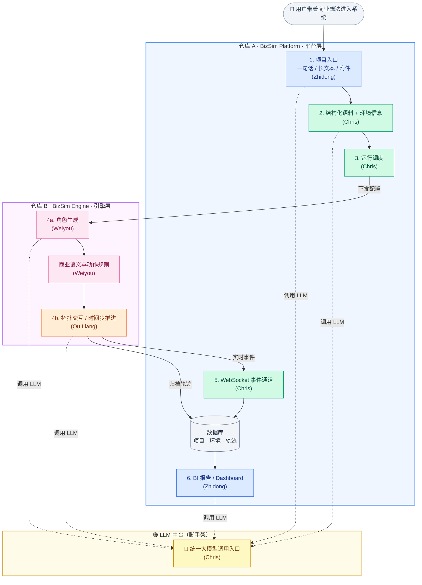

# BizSim 系统架构与数据流转示意图

> 面向团队讨论的架构总览，重点说清楚三件事：
> 1. 一个用户从进入系统到拿到报告，经历了哪些步骤
> 2. 哪些步骤在哪个仓库里实现，谁负责
> 3. 大模型（LLM）在整条链路中扮演什么角色

---

## 一、完整用户故事

> 一句话版：用户带着一个商业想法进来，系统帮他补全环境信息、生成 Agent 角色、跑一轮多 Agent 模拟，最后结合商业分析框架输出一份综合报告。

### 举个例子

用户说："我想在墨尔本开一家宠物商店。"

系统会做这些事：

1. **理解输入** — 用户可能只说了一句话，也可能贴了一篇商业计划书或上传了一个 PDF。系统先把这些原始素材变成结构化的信息（行业、地点、目标客群等）。
2. **补全环境** — 光有用户说的还不够。系统会调用大模型做深度调研（Deep Research），或者接外部数据源，把墨尔本的人口分布、街道布局、宠物市场规模这些背景信息补上。
3. **生成角色** — 有了环境信息，系统会自动生成一批贴合场景的 Agent 角色。比如"有宠物的年轻家庭"、"附近的竞争对手店主"、"本地社区意见领袖"——而不是随便生成一批通用用户。
4. **跑模拟** — 这些 Agent 在一个虚拟环境里交互：消费者会不会来店里？竞争对手会怎么反应？口碑怎么传播？这个过程就是多 Agent 模拟。
5. **观察过程** — 模拟跑的时候，用户可以实时看到 Agent 之间发生了什么（谁买了、谁走了、谁推荐了朋友），看看有没有意料之外的"涌现行为"。
6. **生成报告** — 模拟结束后，系统不会只丢一堆原始数据。它会再调用大模型，结合 Lean Canvas、SWOT、PMF 等商业分析框架，把模拟结果和深度分析揉在一起，输出一份有图表、有结论、有建议的综合报告。

---

## 二、系统架构总览图

自上而下阅读：用户输入 → 平台处理 → 引擎模拟 → 结果回到平台。

节点颜色按**人员分工**区分：🟢 Chris　🔵 Zhidong　🟠 Qu Liang　🟤 Weiyou　🟡 LLM 中台（脚手架）

> **关于"Seed"**：代码里的 `Seed Material` 就是第 1 → 2 步的产物——用户输入经过 LLM 理解和环境补全之后形成的"结构化素材包"，是引擎启动前的全部输入依据。后续可以考虑把这个术语换成更直观的说法。

---

## 三、仓库边界与职责

### 🟦 仓库 A：`bizsim-platform`（平台层）

这个仓库是用户直接接触的部分，也是整个系统的"壳"和"管道"：

- **前端界面**（Zhidong）：项目创建入口、模拟实时观察页、BI 报告页
- **后端服务**（Chris）：API 网关、项目管理、运行调度、WebSocket 事件转发
- **LLM 网关**（Chris）：统一的大模型调用入口，供平台自身和引擎共用
- **数据库**：存储项目信息、结构化素材、模拟轨迹、报告数据

### 🟪 仓库 B：`bizsim-engine`（引擎层）

这个仓库是"模拟大脑"，不直接面对用户：

- **角色生成**（Weiyou）：根据环境信息生成贴合场景的 Agent 角色
- **商业语义**（Weiyou）：定义 Agent 能做什么动作、遵循什么规则
- **拓扑与推进**（Qu Liang）：管理 Agent 之间的交互网络、推进时间步
- **Agent 运行时**（Qu Liang）：调度每个 Agent 的每一步决策（通过 LLM）

### 两个仓库之间怎么通信

平台和引擎之间通过一个约定好的接口（`Simulation Protocol`）通信，而不是把代码混在一起。简单说：

- **平台 → 引擎**：传入结构化素材 + 运行配置，说"开始模拟"
- **引擎 → 平台**：模拟过程中不断推送事件（谁做了什么），结束后交回完整轨迹

这样两个仓库的代码、依赖、部署完全独立，不会互相干扰。

---

## 四、角色分工一览

| 角色 | 颜色 | 主要职责 | 所在仓库 |
|------|------|---------|---------|
| **Chris** | 🟦 | 平台骨架、API、运行调度、LLM 网关、WebSocket | 仓库 A |
| **Zhidong** | 🟦 | 前端界面、项目入口、Simulation Live、BI 报告 | 仓库 A |
| **Qu Liang** | 🟪 | 引擎运行时、拓扑交互、时间步推进、事件输出 | 仓库 B |
| **Weiyou** | 🟪 | 商业语义定义、Agent 角色生成、行为规则 | 仓库 B |

---

## 五、Chris 需要优先搭建的脚手架

基于上面的架构，Chris 在早期需要把这些"管道"先搭好，让其他人能接入：

1. **LLM 网关** — 统一的大模型调用入口，两个仓库共用
2. **运行调度器** — 管理"一次模拟"的生命周期（创建 → 运行中 → 完成 / 失败）
3. **引擎对接接口** — 定义平台和引擎之间传什么数据、怎么触发、怎么接收结果
4. **WebSocket 通道** — 让引擎的实时事件能推到前端
5. **数据存储结构** — 项目、结构化素材、模拟轨迹、报告数据的表结构
